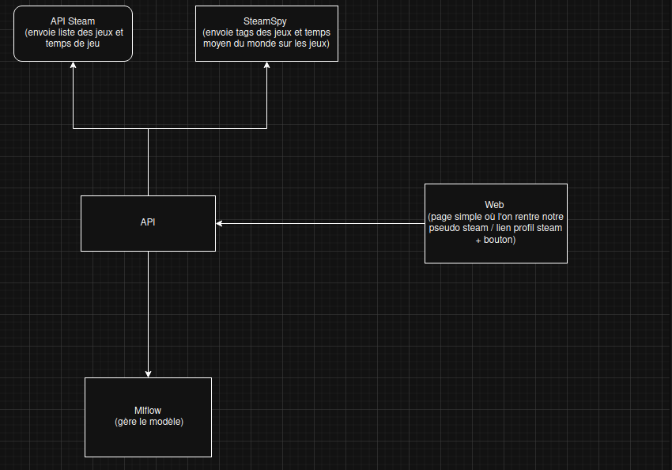

Readme
# Projet SteamUpdate

SteamUpdate (nom provisioire) présente une interface Web permettant de recommander un ou plusieurs jeux provenant du store Steam à un utilisateur, en fonction des jeux qu'il possède et auxquels il a joué.

## Graphes des services

## Utilisation

### Génération de la clé API Steam
[...]